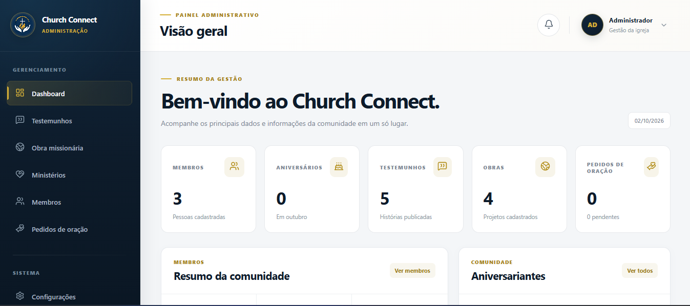
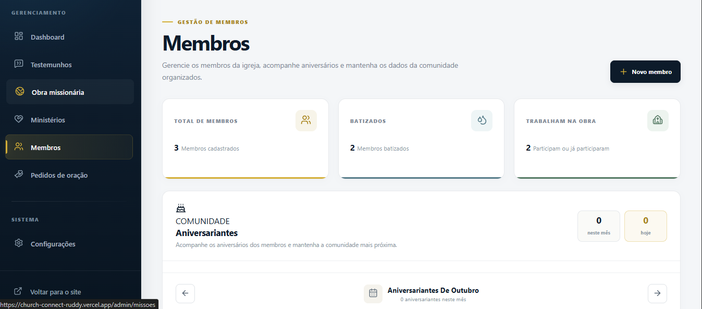
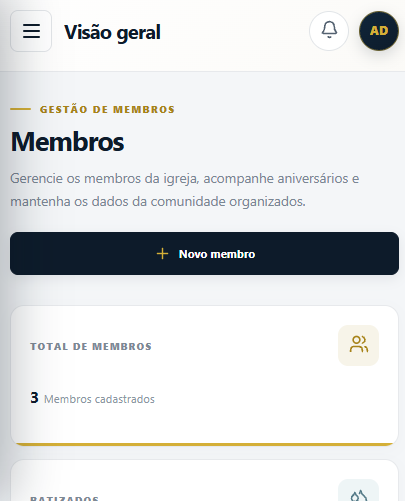

# Church Connect

Plataforma web para comunicação, gestão de conteúdo e administração de uma comunidade religiosa, desenvolvida com **Angular e TypeScript**.

O projeto foi criado para unir uma experiência pública moderna a um painel administrativo completo, permitindo gerenciar membros, testemunhos, ministérios, obras missionárias, pedidos de oração, eventos e informações institucionais.

🌐 **Demo:** https://church-connect-ruddy.vercel.app/  
💻 **Código-fonte:** https://github.com/LuizBarcelar/church-connect

---


## Sobre o projeto

O Church Connect surgiu da proposta de criar uma plataforma digital capaz de centralizar informações da igreja e facilitar a comunicação com sua comunidade.

A aplicação possui duas experiências principais:

- **Área pública**, voltada aos visitantes e membros.
- **Painel administrativo**, destinado ao gerenciamento das informações exibidas na plataforma.

Além da construção da interface, o projeto explora organização de arquitetura Angular, componentes reutilizáveis, serviços compartilhados, gerenciamento de estado local, formulários, CRUDs, rotas protegidas e responsividade.

---

## Principais funcionalidades

### Área pública

- Página inicial responsiva
- Testemunhos e páginas de detalhes
- Obras missionárias
- Ministérios e suas atividades
- Programação e eventos
- Página de detalhes dos eventos
- Formulário para pedidos de oração
- Informações de localização e contato
- Integração das informações configuradas pelo painel administrativo
- Página personalizada para rotas não encontradas

### Painel administrativo

- Dashboard com indicadores
- Gerenciamento de testemunhos
- Gerenciamento de obras missionárias
- Gerenciamento de ministérios
- Cadastro e gerenciamento de membros
- Informações de batismo e atuação ministerial
- Acompanhamento de aniversariantes
- Gerenciamento de pedidos de oração
- Gerenciamento da programação e eventos
- Configurações institucionais
- Central de notificações
- Interface responsiva para desktop, tablet e dispositivos móveis

---

## Dashboard administrativo



O dashboard centraliza informações importantes da comunidade e fornece acesso aos principais módulos administrativos.

A central de notificações utiliza dados da própria aplicação para destacar situações como novos membros, pedidos de oração pendentes e eventos próximos.

---

## Gestão de membros



O módulo de membros permite cadastrar e organizar informações como:

- Dados pessoais
- Telefone e WhatsApp
- Endereço
- Informações de batismo
- Participação ministerial
- Funções exercidas na igreja
- Data de nascimento
- Acompanhamento de aniversariantes

Os registros possuem visualização detalhada e podem ser criados, atualizados ou removidos pelo painel.

---

## Responsividade

O painel administrativo e a área pública foram desenvolvidos para diferentes tamanhos de tela.

<p align="center">
  
</p>

---

## Arquitetura

A aplicação foi organizada por responsabilidades e funcionalidades.

```text
src/app/
├── core/
│   ├── data/
│   ├── guards/
│   ├── models/
│   └── services/
│
├── features/
│   ├── admin/
│   ├── auth/
│   ├── contact/
│   ├── events/
│   ├── home/
│   ├── members/
│   ├── ministry/
│   ├── mission/
│   ├── prayer/
│   └── testimonials/
│
├── layouts/
│   ├── admin-layout/
│   ├── auth-layout/
│   └── public-layout/
│
└── shared/
```

Essa estrutura separa regras compartilhadas, funcionalidades específicas, layouts e componentes reutilizáveis.

---

## Fluxo de dados

Os módulos administrativos e públicos compartilham serviços responsáveis pelo gerenciamento dos dados.

Exemplo:

```text
Painel administrativo
        ↓
Angular Service
        ↓
Persistência local
        ↓
Área pública
```

Dessa forma, conteúdos criados ou editados no painel podem ser refletidos nas respectivas páginas públicas da aplicação.

---

## Tecnologias

- Angular
- TypeScript
- HTML5
- CSS3
- Angular Router
- Angular Forms
- RxJS
- Lucide Icons
- LocalStorage
- Git
- GitHub
- Vercel

---

## Conceitos aplicados

Durante o desenvolvimento foram trabalhados conceitos como:

- Componentização
- Standalone Components
- Separação por features
- Dependency Injection
- Services
- Models e interfaces TypeScript
- Observables e BehaviorSubject
- Comunicação reativa entre componentes
- CRUD
- Persistência no navegador
- Rotas dinâmicas
- Route Guards
- Formulários
- Validação de dados
- Layouts reutilizáveis
- Design responsivo
- Organização de código
- Build de produção
- Versionamento com Git
- Deploy contínuo

---

## Autenticação demonstrativa

A versão publicada utiliza uma autenticação simulada no cliente exclusivamente para fins de demonstração do painel administrativo.

Ela **não representa uma implementação de autenticação adequada para produção**.

Em uma evolução full stack, a autenticação deverá ser realizada no backend, incluindo recursos como:

- Armazenamento seguro de senhas
- Hash de credenciais
- Sessões ou tokens
- Autorização por perfil
- Validação no servidor
- Banco de dados

Essa decisão permite demonstrar o fluxo completo da interface administrativa nesta versão sem apresentar o armazenamento local como uma solução de segurança de produção.

---

## Persistência dos dados

Atualmente, os dados dinâmicos utilizados na demonstração são armazenados no `localStorage`.

Essa abordagem foi utilizada para permitir a execução completa dos CRUDs sem dependência de uma API externa nesta versão.

Como consequência, os dados são locais ao navegador/dispositivo utilizado e não constituem persistência compartilhada entre usuários.

---

## Executando localmente

### Pré-requisitos

- Node.js
- npm
- Angular CLI
- Git

Clone o projeto:

```bash
git clone https://github.com/LuizBarcelar/church-connect.git
```

Entre na pasta:

```bash
cd church-connect
```

Instale as dependências:

```bash
npm install
```

Execute o servidor de desenvolvimento:

```bash
ng serve
```

Acesse:

```text
http://localhost:4200
```

---

## Build de produção

Para gerar o build:

```bash
npm run build
```

Os arquivos de produção serão gerados no diretório `dist`.

---

## Deploy

A aplicação está publicada na Vercel:

**https://church-connect-ruddy.vercel.app/**

O repositório está integrado ao fluxo de versionamento com Git e GitHub.

---

## Próximas evoluções

A arquitetura atual permite evoluir o projeto futuramente para uma solução full stack.

Algumas possibilidades:

- API REST com Node.js/NestJS
- PostgreSQL
- Autenticação JWT
- Perfis e níveis de acesso
- Upload de imagens
- Persistência real dos dados
- Recuperação de senha
- Gerenciamento de usuários administrativos
- Testes automatizados adicionais
- Lazy loading das principais rotas
- Otimização do bundle de produção

---

## Objetivo do projeto

Além de atender a uma necessidade real de comunicação e organização de uma comunidade, o Church Connect foi desenvolvido como projeto de portfólio para demonstrar conhecimentos em desenvolvimento Front-End com Angular e TypeScript.

O projeto busca evidenciar não apenas construção visual, mas também organização de arquitetura, integração entre funcionalidades, gerenciamento de dados, responsividade e desenvolvimento de uma aplicação com múltiplos fluxos de usuário.
